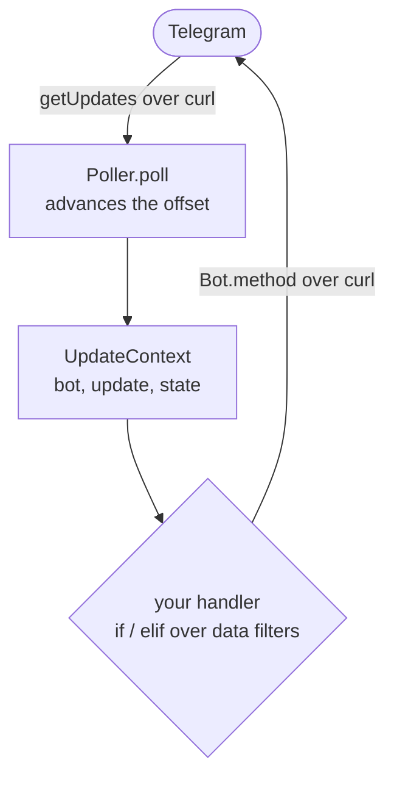

# Architecture

## Data flow

You pull a batch of updates, wrap each one in an `UpdateContext`, and run your
own handler on it. The handler branches on the data filters and calls back into
the bot. There is no framework-owned event loop and no handler registry: you
write the loop, and mojogram supplies the pieces (transport, JSON, typed
updates, FSM, filters, the Bot API).

## Layers

| File | Responsibility |
| ---- | -------------- |
| `http.mojo` | The only thing that touches the network: builds a `curl` command and runs it via `subprocess.run`. |
| `json.mojo` | Pure-Mojo JSON: arena-DOM parser + `Params` serializer + `substr`. |
| `client.mojo` | `Session`, URL building + `{ok,result}` envelope unwrap. |
| `bot.mojo` | `Bot`, typed API methods, multipart uploads, generic `call()`. |
| `types.mojo` | Typed views over the JSON DOM for every event object. |
| `filters.mojo` | Data-only `Match` + factory helpers. |
| `fsm.mojo` | `ArcPointer`-backed shared storage + `State`. |
| `keyboards.mojo` | Keyboard builders emitting JSON text. |
| `context.mojo` | `UpdateContext` handed to your handler. |
| `dispatcher.mojo` | `Poller.poll()` (offset bookkeeping) + `context()`. |
| `server.mojo` | `WebhookServer`, HTTP intake on libc sockets via FFI. |

## Design decisions

### 1. HTTPS via the `curl` CLI

Mojo 1.0 has no native TLS and no stable dynamic loader (`DLHandle`) for binding
libcurl. So the dependable path is to drive the system `curl` binary with
`subprocess.run`, which returns its stdout (the response body). Request bodies and
multipart values are written to temp files and referenced with curl's `@file` and
`<file` syntax, so user content is never interpolated into the shell command.

### 2. JSON as an arena, not boxed recursion

`json.mojo` parses into one `List[JSONNode]`; nodes reference children by *index*,
not a recursive `List[JSONNode]` field. A `JSON` handle is `(ArcPointer to arena,
index)`, `ImplicitlyCopyable`, cheap to pass around. Accessors read via `ref`
bindings so they never copy a node.

### 3. Strings have no `s[a:b]`

Mojo removed String slicing. All substring work goes through `json.substr`, which
slices the UTF-8 **byte `Span`** (which *does* support slicing) and rematerializes
a `String`. Byte offsets from `as_bytes()` stay consistent.

### 4. No stored function pointers, so direct dispatch

`def(...)` is an existential trait in Mojo 1.0 and can't be a struct field or a
`List` element. That kills the dynamic decorator-registry pattern. mojogram instead
calls your handler directly in the loop. So filters carry no custom predicate
callback. They're pure data, and any real logic lives in your handler as ordinary
control flow. Nothing to dispatch through, and the compiler checks it all.

### 5. FSM state via `ArcPointer[Dict]`

Shared mutable state without Python: `StateStore` holds `ArcPointer[Dict]`.
Copying a `StateStore`/`State` bumps a refcount and shares one underlying
`Dict`. Data is keyed flat as `"<chat_id>:<key>"` to avoid mutating a nested `Dict`.

## Copyability rules (Mojo 1.0)

- Structs of only `String`/`Int`/`ArcPointer`/other-`ImplicitlyCopyable` fields are
  declared `(ImplicitlyCopyable, Movable)`, e.g. `JSON`, all `types`, `Bot`,
  `State`, `UpdateContext`.
- Structs with `List`/`Dict` fields **cannot** be `ImplicitlyCopyable`, `JSONNode`,
  `Match`. They stay `(Copyable, Movable)`; copies are explicit (`.copy()` / `^`).

## Concurrency

Mojo 1.0 has no `threading`/`Lock`; the concurrency primitive is `parallelize`
(a thread-pool parallel-for with no GIL, so real parallelism). mojogram processes a poll
batch in parallel **opt-in** (`examples/parallel_bot.mojo`); the default loop is
sequential. Measured ~4× on 8 I/O-bound calls.

Thread-safety is via **slots**: `Bot.with_slot(i)` (used by `Poller.context(update, i)`)
gives each worker its own HTTP temp files, so concurrent `curl` calls never collide.

**FSM is thread-safe.** Mojo 1.0 has no `Lock`, so `StateStore` builds a spinlock
from `Atomic` (`std.atomic`, CAS on a shared heap cell) and takes it around every
Dict op. Stress-tested under `parallelize`: 500 distinct-key writes lose nothing,
1000 contended read-modify-writes total exactly. The lock is held only for the µs
Dict op, never across handler I/O. (It prevents torn state; a get-then-set
*sequence* is still two ops, fine for one-set-per-update flows.)

## Webhook intake

`server.mojo`'s `WebhookServer` is a sequential HTTP/1.1 server on libc sockets via
`external_call` (socket/bind/listen/accept/recv/send). `next()` accepts one request,
replies `200 OK` immediately, and returns the parsed `Update`. Verified end-to-end
over a real ngrok HTTPS tunnel (public TLS → tunnel → Mojo server → 200). No threads,
so it's single-connection; scale with N processes behind nginx.

## Not built (extension points)

| Feature | Note |
| ------- | ---- |
| Async dispatch | Not in Mojo 1.0; `parallelize` covers parallel batch processing. |
| In-process webhook concurrency | Server is single-connection (no threads); scale with N processes + nginx. |
| Full typed API | All methods reachable via `call(method, Params)`. |
| Persistent FSM | Implement the `State` method surface over Redis/DB (keep the spinlock or use the DB's). |
