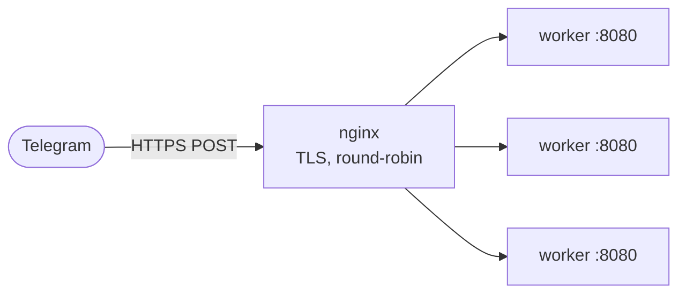

# Deployment

A mojogram bot is a single native process. Two ways to run it in production:
long-polling, which needs nothing but the binary and an outbound connection, or
webhooks, which need a public HTTPS endpoint.

## Polling

The simplest deploy. No inbound ports, no TLS, no proxy. The process long-polls
Telegram and handles updates in its own loop. Run it under whatever keeps a
process alive: a systemd unit, a `restart: always` container, `supervisord`.

```bash
export BOT_TOKEN="123456:your-token"
pixi run mojo run -I . yourbot.mojo
```

If one process can't keep up, polling doesn't shard cleanly (two pollers fight
over the same offset), so for scale switch to webhooks.

## Webhooks behind nginx

The webhook server handles one connection at a time, since Mojo 1.0 has no
threads. You get throughput by running several worker processes behind a proxy
that terminates TLS and round-robins across them. The `deploy/` folder has a
working stack for exactly this.



Three files drive it:

- `deploy/Dockerfile` builds an Ubuntu image, installs pixi and the MAX/Mojo
  toolchain, copies the package, and runs `examples/webhook_bot.mojo`. The first
  build pulls the toolchain, which is large (about a GB), so expect a slow
  initial build.
- `deploy/nginx.conf` listens on 443, terminates TLS, and proxies to the `bot`
  service. Docker DNS resolves `bot:8080` to every replica, so nginx
  round-robins for free.
- `deploy/docker-compose.yml` wires the two together. The bot service has no
  host port; only nginx can reach it.

### Bring it up

```bash
# put your TLS cert where nginx expects it
mkdir -p deploy/certs
cp fullchain.pem privkey.pem deploy/certs/

export BOT_TOKEN="123456:your-token"
docker compose -f deploy/docker-compose.yml up --build --scale bot=3
```

`--scale bot=3` runs three worker processes. Bump the number to match your load.

### Register the webhook once

Telegram needs to know where to POST. Point it at your domain, and set a secret
token so only Telegram's requests are accepted:

```bash
curl "https://api.telegram.org/bot$BOT_TOKEN/setWebhook?url=https://YOUR_DOMAIN&secret_token=YOUR_SECRET"
```

Then construct the server with the same secret. It compares the value against
Telegram's `X-Telegram-Bot-Api-Secret-Token` header and drops anything that
doesn't match:

```mojo
var srv = WebhookServer(Bot(token), 8080, secret_token="YOUR_SECRET")
while True:
    handle(srv.context(srv.next()))
```

Telegram only POSTs to HTTPS, and it wants a valid certificate. Use a real one
or Let's Encrypt; a self-signed cert won't be accepted in production.

## Reproducible builds

Mojo is pre-1.0 and the toolchain moves between nightlies. Commit your
`pixi.lock` (or `uv.lock`) so a deploy six weeks from now resolves the same
compiler you tested against. Without a lockfile a rebuild can pull a newer
nightly that breaks the build.

## Checking curl at startup

The whole transport is the system `curl`. The Docker image installs it, but if
you deploy somewhere hand-rolled, call `curl_available()` once at boot so a
missing binary fails loudly instead of on the first API call:

```mojo
from mojogram.http import curl_available

if not curl_available():
    raise Error("curl is not on PATH; mojogram needs it for HTTP")
```
