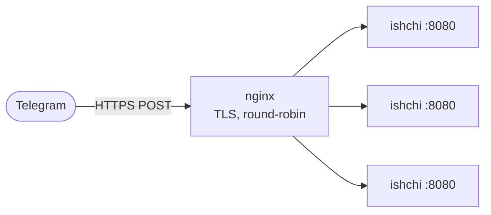

# Joylashtirish (deployment)

mojogram boti bitta native jarayon. Uni ishlab chiqarishda yurgizishning ikki
yo'li: long-polling, unga binary va tashqi ulanishdan boshqa hech narsa kerak
emas, yoki webhook, unga ochiq HTTPS endpoint kerak.

## Polling

Eng oddiy deploy. Kiruvchi portlar yo'q, TLS yo'q, proxy yo'q. Jarayon
Telegram'ni long-poll qiladi va yangilanishlarni o'z siklida ishlaydi. Uni
jarayonni tirik saqlaydigan istalgan vosita ostida yuriting: systemd unit,
`restart: always` konteyner, `supervisord`.

```bash
export BOT_TOKEN="123456:your-token"
pixi run mojo run -I . yourbot.mojo
```

Bitta jarayon yetishmasa, polling toza shardlanmaydi (ikki poller bir xil offset
uchun kurashadi), shuning uchun kengaytirish kerak bo'lsa webhook'ga o'ting.

## nginx orqasidagi webhook'lar

Webhook server bir vaqtda bitta ulanishni ishlaydi, chunki Mojo 1.0'da threadlar
yo'q. O'tkazuvchanlikni TLS'ni tugatib, ular bo'ylab round-robin qiladigan proxy
orqasida bir nechta ishchi jarayon yurgizib olasiz. `deploy/` papkasida aynan shu
uchun ishlaydigan stack bor.



Uni uch fayl boshqaradi:

- `deploy/Dockerfile` Ubuntu image quradi, pixi va MAX/Mojo toolchain'ni
  o'rnatadi, paketni ko'chiradi va `examples/webhook_bot.mojo`'ni yurgizadi.
  Birinchi build toolchain'ni tortadi, u katta (taxminan 1 GB), shuning uchun
  birinchi build sekin bo'lishini kuting.
- `deploy/nginx.conf` 443'da tinglaydi, TLS'ni tugatadi va `bot` servisiga
  proxy qiladi. Docker DNS `bot:8080`'ni har replicaga hal qiladi, shuning uchun
  nginx tekinga round-robin qiladi.
- `deploy/docker-compose.yml` ikkalasini bog'laydi. Bot servisida host port
  yo'q; unga faqat nginx yeta oladi.

### Ishga tushirish

```bash
# TLS sertifikatingizni nginx kutadigan joyga qo'ying
mkdir -p deploy/certs
cp fullchain.pem privkey.pem deploy/certs/

export BOT_TOKEN="123456:your-token"
docker compose -f deploy/docker-compose.yml up --build --scale bot=3
```

`--scale bot=3` uchta ishchi jarayon yurgizadi. Yukingizga qarab sonni oshiring.

### Webhook'ni bir marta ro'yxatdan o'tkazish

Telegram qayerga POST qilishni bilishi kerak. Uni domeningizga yo'naltiring va
secret token o'rnating, shunda faqat Telegram'ning so'rovlari qabul qilinadi:

```bash
curl "https://api.telegram.org/bot$BOT_TOKEN/setWebhook?\
url=https://YOUR_DOMAIN&secret_token=YOUR_SECRET"
```

Keyin serverni o'sha secret bilan quring. U qiymatni Telegram'ning
`X-Telegram-Bot-Api-Secret-Token` sarlavhasiga solishtiradi va mos kelmaganini
tashlab yuboradi:

```mojo
var srv = WebhookServer(Bot(token), 8080, secret_token="YOUR_SECRET")
while True:
    handle(srv.context(srv.next()))
```

Telegram faqat HTTPS'ga POST qiladi va haqiqiy sertifikat talab qiladi. Haqiqiy
yoki Let's Encrypt sertifikatidan foydalaning; self-signed sertifikat ishlab
chiqarishda qabul qilinmaydi.

## Takrorlanadigan buildlar

Mojo 1.0'gacha, va toolchain nightly'lar orasida o'zgaradi. `pixi.lock` (yoki
`uv.lock`) ni commit qiling, shunda olti haftadan keyingi deploy siz sinagan
xuddi shu kompilyatorni hal qiladi. Lockfilesiz qayta build yangiroq nightly
tortib, buildni buzishi mumkin.

## Boshlanishida curl'ni tekshirish

Butun transport tizimdagi `curl`. Docker image uni o'rnatadi, lekin biror
qo'lbola joyga deploy qilsangiz, boshlanishida `curl_available()`'ni bir marta
chaqiring, shunda yo'q binary birinchi API chaqiruvida emas, baland ovozda
yiqiladi:

```mojo
from mojogram.http import curl_available

if not curl_available():
    raise Error("curl PATH'da yo'q; mojogram'ga u HTTP uchun kerak")
```
